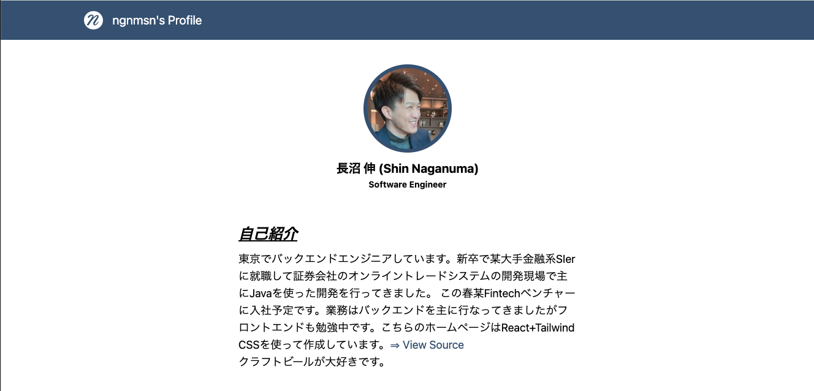

# ngnmsn's Profile

## Link

[ngnmsn's Profile](https://ngnmsn.github.io/myprofile/)



## Use

- React
- Tailwind CSS
- TypeScript

## Project structure

```
$PROJECT_ROOT
│   # Static files
├── public
│   # React Module
└── src
    │   # Components within a page
    ├── components
    │   # Image Assets on React
    └── img
```